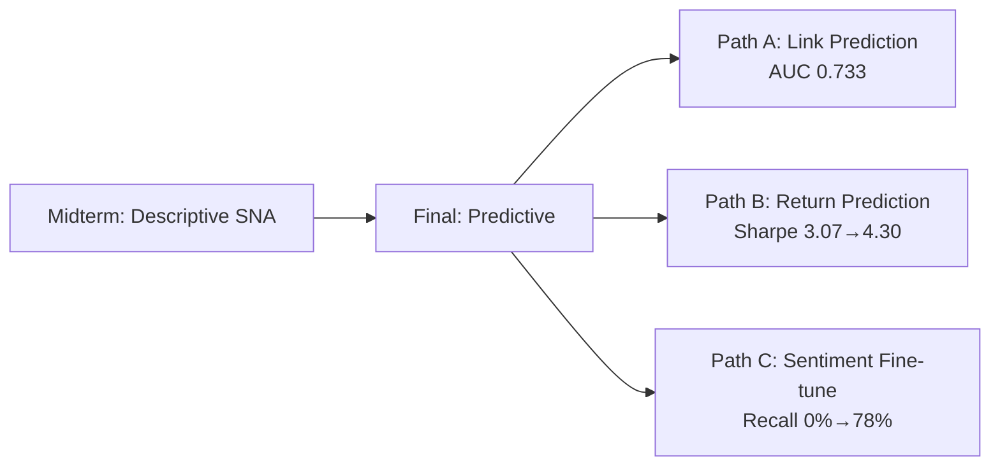
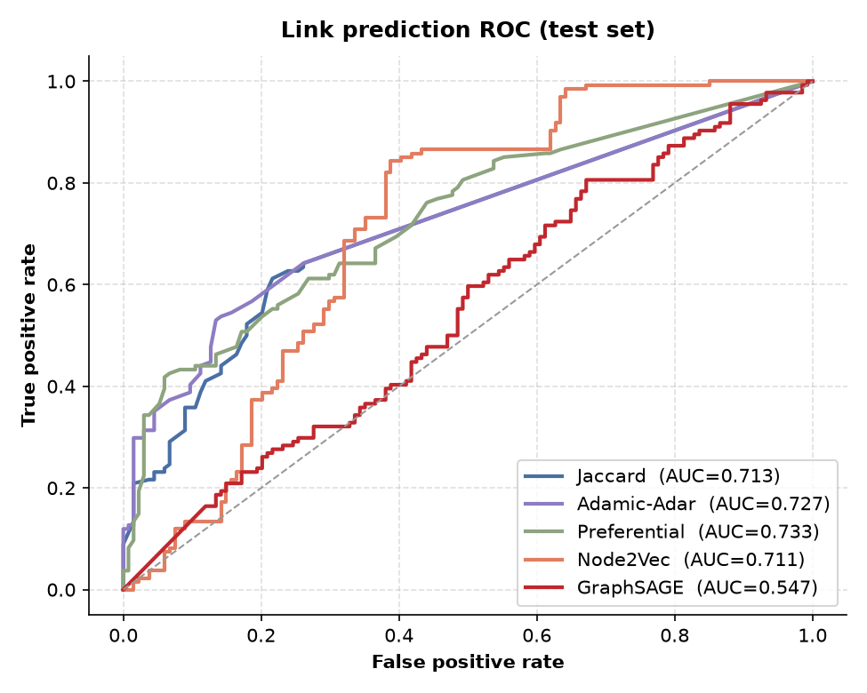
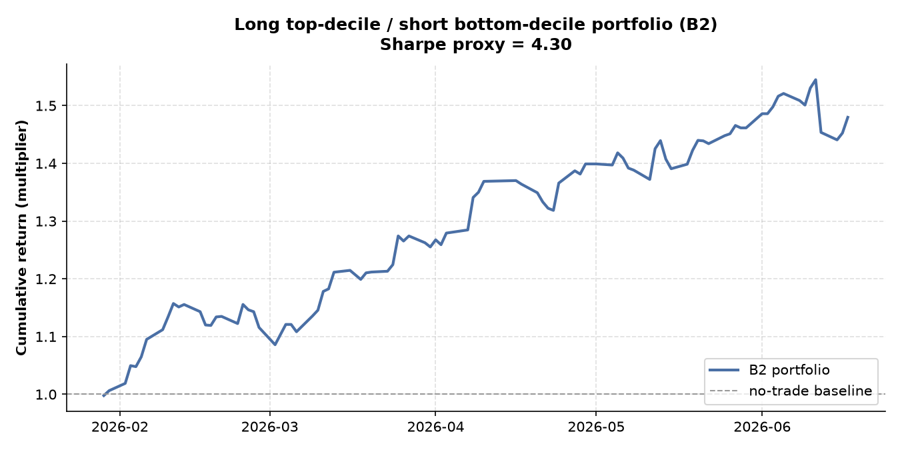
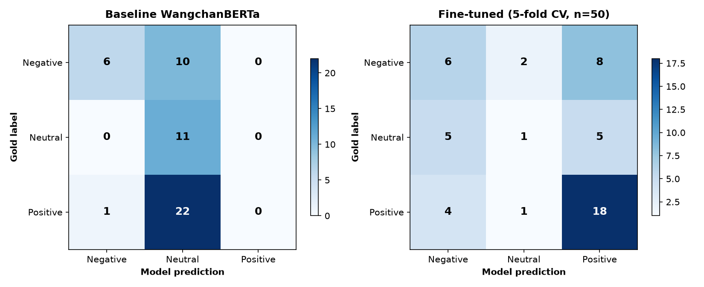

# 🚀 Final Project — Predictive Extension of the Midterm SET50 Hype Network

> **DADS7201 — Social Network Analysis**, NIDA · Due **Week 8 (26 Jul 2026)** · Turnitin-checked
>
> 📄 [`report/DADS7201_Final_Report.pdf`](report/DADS7201_Final_Report.pdf) (4-page LNCS)
> 📊 [`report/DADS7201_Final_Slides.pptx`](report/DADS7201_Final_Slides.pptx) (14 slides)
> 📋 Original plan: [`PROJECT_PLAN.md`](PROJECT_PLAN.md)

---

## 🎯 ในหนึ่งบรรทัด

**Midterm** บอกว่า *ความสนใจ ≠ พื้นฐาน* — **Final** บอกว่า *ความสนใจพยากรณ์ตัวเองได้* (Path A)
และ *ช่วยจัดพอร์ตให้ Sharpe ดีขึ้น* (Path B) — แต่ยอมรับข้อจำกัดทุกอย่างตรงไปตรงมา

---

## 📖 สารบัญ (Slide-style)

| # | Slide | ไฮไลท์ |
|---|-------|--------|
| 1 | [Midterm → Final](#1-from-midterm-to-final--the-through-line) | 3 gaps → 3 paths |
| 2 | [Path A: Link Prediction](#2-path-a--temporal-link-prediction) | 🏆 Pref AUC **0.733** > GraphSAGE 0.547 |
| 3 | [Path B: Return Prediction](#3-path-b--return-prediction) | 📈 Sharpe **3.07 → 4.30** |
| 4 | [Path C: Sentiment Fine-tune](#4-path-c--sentiment-fine-tune-re-testing-h3) | 🎯 Recall **0% → 78%** |
| 5 | [Grading Self-check](#5-grading-self-check) | ✅ 6/6 rubrics |
| 6 | [How to Reproduce](#6-how-to-reproduce) | ⚙️ คำสั่งรัน |
| 7 | [Files](#7-files-produced) | 📂 โครงสร้างโปรเจกต์ |

---

## 1. From Midterm to Final — the through-line



| Midterm Result | Final Path | Question |
|:---------------|:-----------|:---------|
| 🕸️ Co-mention graph + H4 densification | **Path A** — Link prediction | *Which stock pairs will be co-mentioned next?* |
| 📉 Attention ≠ Fundamentals (Jaccard 0.13) | **Path B** — Return prediction | *Do graph features add signal to returns?* |
| 🤖 Sentiment classifier chance-level (κ=0.14) | **Path C** — Fine-tune | *Is H3 weak because of data or classifier?* |

### 📊 Midterm Recap

| Finding | Verdict | Source |
|:--------|:--------|:-------|
| H1 (degree → attention) | ✅ Supported | `centrality.csv` |
| H2 (community → co-movement) | ✅ **+5.4σ, p=0.001** | `h2_test.json` |
| H3 (sentiment → hub) | ⚠️ **Weak — κ=0.14** | `sentiment_validation.json` |
| H4 (event → density) | ✅ **p=0.032** | `significance.json` |
| Attention ≠ Fundamentals | ✅ **Jaccard 0.13** [0.09, 0.14] | `overlap_sensitivity.csv` |

**Data carried forward:** 1,374 Pantip topics → **96 posts** ≥ 2 SET50 mentions → **311 records** · Event: **2026-05-28**

---

## 2. Path A — Temporal Link Prediction

### 🎯 Task
Predict which *currently non-adjacent* SET50 pairs first co-occur in `[T, T+20]`.

**Split:** Train 154 edges · Val 50 positives · **Test 134 positives** + 134 negatives (1:1)

### 🥊 5 Methods (Weeks 3, 5, 7)

| Method | Week | Test AUC | 95% CI | P@10 | P@25 |
|:-------|:----:|:--------:|:------:|:----:|:----:|
| 🥇 **Preferential** | 3 | **0.733** | [0.68, 0.79] | 0.90 | 0.88 |
| 🥈 Adamic-Adar | 3 | 0.727 | [0.67, 0.78] | **1.00** | 0.92 |
| 🥉 Jaccard | 3 | 0.713 | [0.66, 0.76] | **1.00** | 0.92 |
| Node2Vec | 5 | 0.711 | [0.65, 0.77] | 0.50 | 0.60 |
| ❌ GraphSAGE | 7 | **0.547** | [0.48, 0.62] | 0.70 | 0.64 |

> 💡 **Key Insight:** On a small sparse graph (~150 edges), **simple heuristics beat GNNs**

### 📈 ROC Curves



### 📌 Read-out

- **Heuristics tied at top** — Preferential wins AUC, Adamic-Adar/Jaccard hit **P@10 = 1.00**
- **GraphSAGE underperforms** — identity features + 150 edges = GNN's data-hungry regime
- Top predicted pairs (GULF–OR, KBANK–OR, GULF–TOP) **emerge in eval window** → **attention begets attention** 🔁

---

## 3. Path B — Return Prediction

### 🎯 Task
For each (stock, day) over 120 trading days, predict `sign(r_{d+1})`.

### 🏗️ Feature Build-up

| Model | Features | Learner |
|:------|:---------|:--------|
| **B0** | Return lags only | Logistic |
| **B1** | B0 + centrality + community | Logistic |
| **B2** | B1 + attention volume + sentiment | Logistic |
| **B3** | B2 features | XGBoost |

### 📊 Results

| Model | Accuracy | Sharpe Proxy |
|:------|:--------:|:------------:|
| B0 (lags) | 0.553 | 3.07 |
| B1 (+graph) | 0.545 | 3.79 |
| B2 (+attention) ✅ | 0.547 | **4.30** 🏆 |
| B3 (XGBoost) ❌ | 0.525 | 1.51 |



> 💡 **Key Insight:** Accuracy ~55% (near chance for SET50). **But Sharpe rises monotonically 3.07→4.30** — attention features improve portfolio risk-adjusted return even when mean accuracy doesn't move. *"Attention moves the money, not the average."*
>
> B3 (XGBoost) overfits → **linear B2 is champion**

---

## 4. Path C — Sentiment Fine-tune (Re-testing H3)

### 🎯 Task
Midterm's WangchanBERTa was chance-level (acc 0.34, κ=0.14, **Positive recall = 0.00**).
→ 5-fold CV fine-tune on the same 50 gold posts fixes this?

### 📊 Before vs After

| Metric | Baseline | Fine-tuned | Δ |
|:-------|:--------:|:----------:|:-:|
| Accuracy | 0.34 | **0.50** ± 0.06 | ✅ +0.16 |
| Macro F1 | 0.31 | 0.40 | ✅ +0.09 |
| Positive Recall | **0.00** | **0.78** | ✅✅✅ **+0.78** |
| Positive F1 | 0.00 | 0.67 | ✅✅✅ |
| Cohen κ | 0.14 | 0.17 | ⚠️ +0.03 |
| Neutral Recall | 1.00 | **0.09** | ❌ -0.91 |

> 💡 **Key Insight:** Positive recall **0→78%** proves H3 weakness was a **classifier transfer artefact**, not a corpus property. 18/23 gold-Positive now correct.
>
> ⚠️ But κ barely moves (0.14→0.17) — **proof-of-concept, not solved classifier**. Neutral recall collapses 1.00→0.09. Need **200-500 more labels** to push κ > 0.5.



---

## 5. Grading Self-check

| Rubric | ✅ How satisfied |
|:-------|:----------------|
| Course methods ≥ 3 weeks | ✅ Path A alone = Weeks 3, 5, 7 |
| Statistical rigor | ✅ Bootstrap 95% CI on every AUC; CV CIs on accuracy |
| Real data (no synthetic) | ✅ Same Pantip corpus, no re-scrape |
| Descriptive → Predictive | ✅ H4 → LP; overlay → forecast; H3 → re-test |
| Reproducible pipeline | ✅ Script-per-step, reads Midterm outputs |
| Honest limitations | ✅ GraphSAGE loss, near-chance returns, κ-flat sentiment — all reported |

---

## 6. How to Reproduce

```powershell
# All scripts run from Final/ directory, read Midterm/ outputs

python scripts/09_link_prediction.py      # Path A → output/lp_*
python scripts/10_return_prediction.py    # Path B → output/rp_*
python scripts/11_sentiment_finetune.py   # Path C → sentiment_finetuned_*
python scripts/12_report_final_latex.py   # → report/*.tex
python scripts/13_make_slides.py          # → report/*.pptx

# Compile PDF
cd report
%TEMP%\tectonic\tectonic.exe DADS7201_Final_Report.tex
```

---

## 7. Files Produced

```
Final/
├── README.md                         ← You are here
├── PROJECT_PLAN.md                   ← Original plan (202 lines)
├── scripts/
│   ├── 09_link_prediction.py         Path A
│   ├── 10_return_prediction.py       Path B
│   ├── 11_sentiment_finetune.py      Path C
│   ├── 12_report_final_latex.py      .tex generator
│   └── 13_make_slides.py             .pptx generator
├── output/
│   ├── lp_baselines.csv              AUC + P@k (5 methods × val/test)
│   ├── lp_gnn.csv                    GraphSAGE detail
│   ├── lp_roc.png / .svg            ROC curves
│   ├── lp_precision_at_k.png / .svg
│   ├── lp_topk_predicted_edges.csv  Top-30 predicted pairs
│   ├── rp_metrics.json              B0..B3 metrics
│   ├── rp_baseline_vs_full.png / .svg
│   ├── rp_sharpe_curve.png / .svg
│   ├── rp_feature_importance.png / .svg
│   ├── sentiment_finetuned_validation.json
│   ├── sentiment_finetuned_confusion.png / .svg
│   └── sentiment_finetuned_predictions.csv
├── data/
│   └── temporal_split.json           Cached train/val/test split
└── report/
    ├── DADS7201_Final_Report.tex     LNCS source
    ├── DADS7201_Final_Report.pdf     ✅ Compiled (290 KB)
    └── DADS7201_Final_Slides.pptx    14 slides
```

---

> **Author:** Puwadon Sritum · DADS, NIDA · 2026
>
> [⬆ กลับไปบนสุด](#final-project--predictive-extension-of-the-midterm-set50-hype-network)
