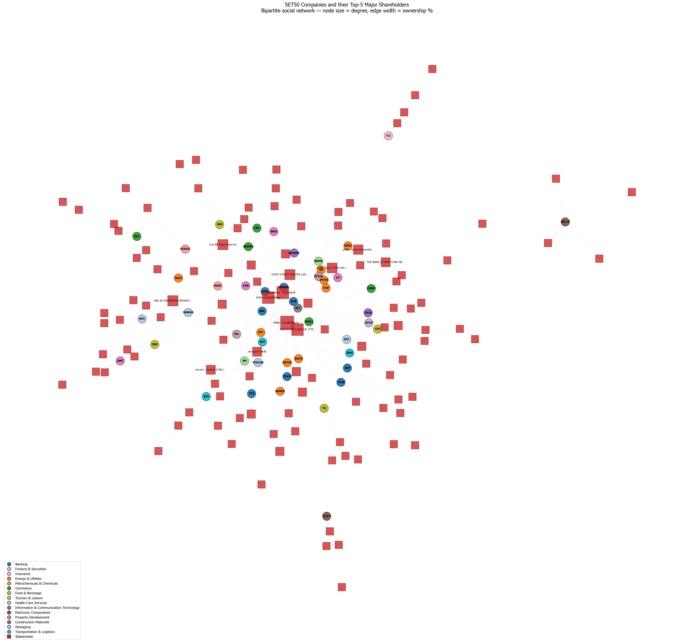

# SET50 Stakeholder Social Network

A bipartite social-network visualization of the **50 listed companies in the
SET50 (H1 2026 constituents)** and their **top-5 major shareholders**, built
for **DADS7201 — Social Network Analysis (Week 1)**.



- 🕸 Interactive graph (pyvis / vis-network)
- 🖼 Static spring-layout snapshot (matplotlib)
- 📊 Centrality table — degree, weighted degree, betweenness, eigenvector
- 📄 Downloadable filtered edge list & metrics

## Live demo

Deploy to [Streamlit Community Cloud](https://share.streamlit.io) — see
**Deploy** section below.

## Run locally

```bash
pip install -r requirements.txt
streamlit run streamlit_app.py
```

Open http://localhost:8501 in a browser.

## Files

| File | Purpose |
|---|---|
| `streamlit_app.py` | Streamlit UI — sidebar filters, tabs for interactive/static/metrics |
| `build_set50_network.py` | Stand-alone script — writes PNG + HTML + metrics CSV |
| `set50_companies.py` | Selenium scraper that refreshes `set50_stakeholders.csv` from set.or.th |
| `set50_stakeholders.csv` | Edge list: `company, company_name, sector, stakeholder, pct` |
| `requirements.txt` | Python deps for Streamlit Cloud |
| `packages.txt` | apt packages for Streamlit Cloud (Thai fonts) |
| `.streamlit/config.toml` | Streamlit theme / server config |

## Deploy to Streamlit Community Cloud

This folder lives inside the parent repo `DADS7201_Social_Network/`. See
the [top-level README](../README.md) for the full git-push workflow.

To deploy **this week** on Streamlit Cloud:

1. Go to https://share.streamlit.io → **New app**.
2. Repo: `puwadonsri/DADS7201_Social_Network`, branch: `main`.
3. **Main file path:** `Week1/streamlit_app.py`
4. Click **Deploy**. First build takes ~3 min — pip installs
   `Week1/requirements.txt` and apt installs `Week1/packages.txt`
   (Thai fonts).
5. The URL will be something like `https://<your-app>.streamlit.app`.

For Week2/Week3 in the future, create a new Streamlit Cloud app and
point it at `Week2/streamlit_app.py`, etc. — same repo, separate apps.

## Data sources

| Field | Source | Status |
|---|---|---|
| **Company list (50 tickers + sectors)** | *SET50 / SET50FF Index Constituents, H1 2026* — official PDF from the Stock Exchange of Thailand (period 1 Jan – 30 Jun 2026, updated 15 Dec 2025) | ✅ verbatim match |
| **Top-5 shareholder names + percentages** | Scraped live from each ticker's *Major Shareholders* page on `set.or.th` using Selenium (`set50_companies.py`) | ✅ real data |

### How the scrape works
The set.or.th Major Shareholders pages render client-side via an XHR to
`/api/set/stock/{symbol}/major-shareholders`, which is protected by an
**Imperva Incapsula JavaScript challenge**. Plain `requests` and even
TLS-fingerprint spoofing (curl-cffi impersonating Chrome 110–131) return
403. The fix is a real browser — `set50_companies.py` drives Chrome via
Selenium, waits for the shareholder table to hydrate, and reads
`textContent` from each row (handling the CSS-hidden text that
`element.text` can't see).

To refresh the data:

```bash
python set50_companies.py
```

This needs **Chrome + matching chromedriver** on PATH. It loops through
all 50 SET50 tickers with a 3-second delay between requests and writes
`set50_stakeholders.csv` in UTF-8 BOM.

### Verifying in the app
Every company row in the **📄 Data** tab has a 🔗 link straight to its
official Major Shareholders page on set.or.th — useful for cross-checking
percentages against the SET book-closing date displayed there.

Replace `set50_stakeholders.csv` with your own figures any time — the
Streamlit app reads it at startup, no code changes needed.

## Graph model

- **Nodes (170):** 50 SET50 companies + 120 unique stakeholders
- **Edges (250):** undirected, weighted by ownership %
- **Bipartite:** companies ↔ stakeholders only (no company-company or
  stakeholder-stakeholder edges)
- **Components:** 2 — a giant component (49 companies) and an isolated
  **DELTA** cluster whose top-5 holders are all Delta corporate entities +
  foreign nominees that don't overlap with any other SET50 company

## Key SNA findings (real data)

| Stakeholder | Degree | Notes |
|---|---|---|
| บริษัท ไทยเอ็นวีดีอาร์ จำกัด (Thai NVDR) | 45 | Foreign-investor NVDR mechanism |
| กองทุนรวม วายุภักษ์หนึ่ง (Vayupak Fund 1) | 18 | Thai state-backed fund |
| สำนักงานประกันสังคม (Social Security Office) | 17 | Thai pension fund |
| SOUTH EAST ASIA UK (TYPE C) NOMINEES LIMITED | 15 | Foreign nominee custodian |
| UBS AG SINGAPORE BRANCH | 7 | Foreign client-account custodian |
| นาย นิติ โอสถานุเคราะห์ | 6 | Individual investor appearing in 6 top-5 lists |
| STATE STREET EUROPE LIMITED | 6 | Global custodian |
| บริษัท ปตท. จำกัด (มหาชน) (PTT) | 5 | Parent of PTTEP, PTTGC, OR, TOP, GPSC |
| กระทรวงการคลัง (Ministry of Finance) | 3 | AOT, TTB, ... |

These hub-and-spoke patterns are exactly what motivates graph analysis over
relational JOINs in the Ch1 lecture.
