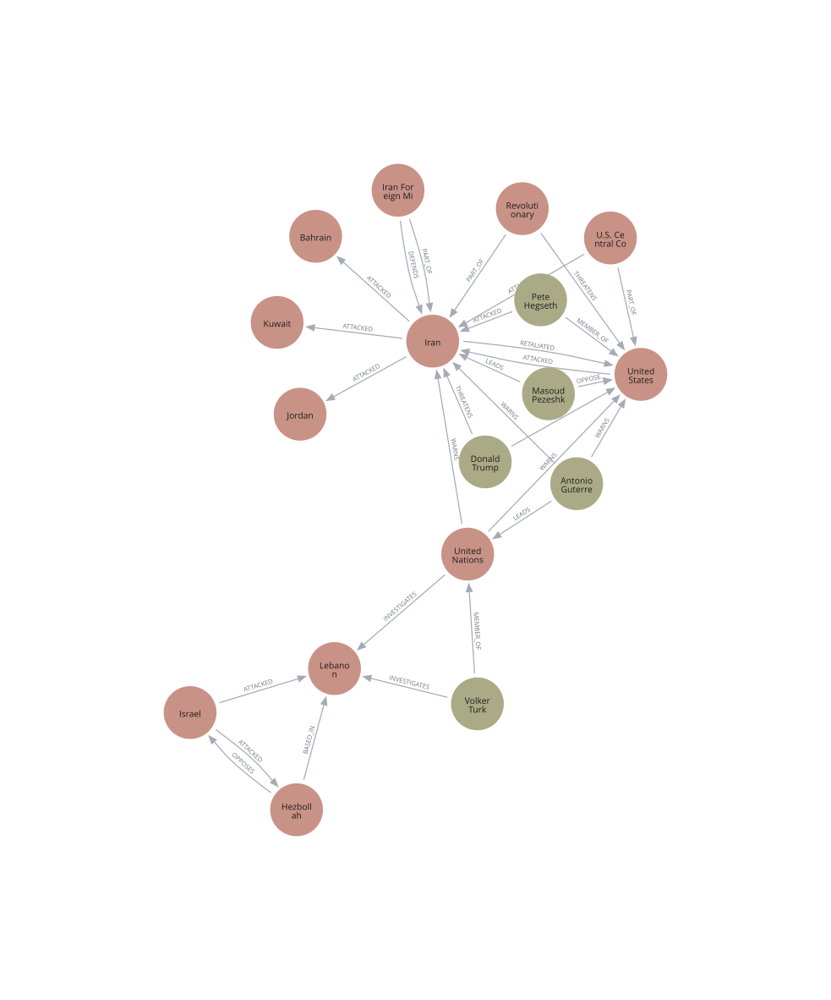

# Centrality on a Conflict News Graph (Neo4j Aura)

Week 2 of **DADS7201 — Social Network Analysis** at NIDA.

We extract entities and relationships from a Thai PBS news article on the
US–Iran / Israel–Hezbollah escalation, model them as a property graph in
**Neo4j Aura**, then compute and visualize the five centrality measures
introduced in the Ch2 lecture.



> Exported snapshot from the Aura console.
> **Live interactive version**: <https://puwadonsri.github.io/DADS7201_Social_Network/Week2/graph.html>
> (served via GitHub Pages — regenerate locally with `python visualize.py`).

## Lecture topic — Centrality

From `Slide/ch2-nw-models-student.pdf` and `Slide/GraphHelpSession.pdf`:

| Measure | Idea | Best at finding |
|---|---|---|
| **Degree** | How many direct neighbours? | Hubs |
| **Closeness** | Avg shortest-path distance to everyone else | Efficient broadcasters |
| **Betweenness** | How often on shortest paths between others? | Bridges / brokers |
| **Eigenvector** | Connected to other important nodes? | Influential "inner circle" |
| **Katz** | Eigenvector + a baseline so isolated nodes still get a score | Influence with distance attenuation |
| **PageRank** | Random-walk steady state with damping (α = 0.85) | Robust hubs, handles sinks |

## What was built

1. Fetched a [Thai PBS news article](https://www.thaipbs.or.th/news/content/506930)
   on US–Iran / Israel–Hezbollah tensions.
2. Extracted **17 entities** (7 countries, 5 people, 5 organisations) and
   **29 relationships** (`ATTACKED`, `WARNS`, `LEADS`, `PART_OF`, etc.) into CSVs.
3. Loaded them into **Neo4j Aura** (free tier) via the official Python driver
   — no GDS / APOC required.
4. Computed Degree, Closeness, Betweenness, Eigenvector, Katz, and PageRank
   with **NetworkX** and wrote each score back as a node property in Aura.
5. Built an interactive **PyVis** graph: node size = betweenness, colour =
   entity type, hover = role + all centrality scores.

## Files

| File | Purpose |
|---|---|
| `nodes_aura.csv` | 17 entities — columns: `id, name, label, role, country` |
| `relationships_aura.csv` | 29 relationships — `start_id, end_id, type, description` |
| `import_to_aura.py` | Push both CSVs into Aura via UNWIND batches |
| `centrality.py` | Pull graph → compute 5 centralities → write back → export `centrality.csv` |
| `visualize.py` | Build `graph.html` (PyVis interactive view) |
| `requirements.txt` | Pinned dependencies for reproducibility |
| `Neo4j-*.txt` | Aura credentials — **gitignored at repo root** |
| `Slide/` | Lecture slides — **gitignored** (kept local only) |

## How to reproduce

```powershell
pip install -r requirements.txt

# put your Aura credentials text file in this folder as Neo4j-*.txt
python import_to_aura.py   # CSV -> Aura
python centrality.py        # compute + write back + dump centrality.csv
python visualize.py         # generate graph.html (then open in a browser)
```

## Key findings

The graph collapses to 28 unique directed edges (not 29) because
`IR_MFA→IR` has two distinct relationships (`PART_OF` + `DEFENDS`) which
`nx.DiGraph` merges into one edge.

| Rank by | Top entity | Interpretation |
|---|---|---|
| Degree | **Iran (0.81)** | Hit from many sides + retaliates outward |
| Betweenness | **Iran (0.13)**, UN (0.03) | Iran sits on most shortest paths; UN is the secondary bridge via `WARNS` |
| Closeness | **Iran (0.57)**, US (0.52) | Closest to the conflict core |
| Eigenvector | **Iran ≈ US (0.44)** | Both central and connected to each other |
| Katz | **Iran (0.39)**, US (0.38) | Confirms Iran as overall influence hub |
| PageRank | **Iran (0.24)**, US (0.14), Lebanon (0.08) | Random-walk hub view; Lebanon ranks 3rd as the most-pointed-at victim of `ATTACKED`/`INVESTIGATES` |

## Cypher patterns used

Quick reference of the Cypher used in this exercise — see the official
[Cypher Cheat Sheet (Community Edition)](https://neo4j.com/docs/cypher-cheat-sheet/25/neo4j-community/)
for the full grammar.

| Pattern | Used for |
|---|---|
| `MATCH (n) DETACH DELETE n` | Wipe graph before re-import |
| `CREATE CONSTRAINT entity_id IF NOT EXISTS FOR (n:Entity) REQUIRE n.id IS UNIQUE` | Dedup by business key |
| `UNWIND $rows AS row CREATE (n:Entity:Country) SET n.id = row.id, ...` | Batch node creation |
| `UNWIND $rows AS row MATCH (a:Entity {id: row.start}), (b:Entity {id: row.end}) CREATE (a)-[r:ATTACKED]->(b)` | Batch edge creation |
| `MATCH (n:Entity) RETURN n.id, n.name, labels(n)` | Read graph back for NetworkX |
| `MATCH (a)-[r]->(b) RETURN type(r), count(*)` | Verify counts |
| `MATCH (n:Entity) RETURN n.name, n.degree, n.betweenness, n.pagerank ORDER BY n.betweenness DESC LIMIT 10` | Inspect centrality results after `centrality.py` writes them back |

## Notes

- **No GDS on Aura free tier.** Centrality is computed client-side with
  NetworkX. With Aura DS you can call `gds.degree.stream`,
  `gds.pageRank.stream`, etc. directly.
- **Directed graph.** Closeness and betweenness honour edge direction.
  Eigenvector / Katz / PageRank here use the in-degree formulation,
  i.e. "influence flowing in".
- **Directed-closeness caveat.** `nx.closeness_centrality(G)` on a DiGraph
  measures *incoming* shortest-path distance, so source-only nodes
  (Trump, Pezeshkian, Hegseth, ...) have **closeness = 0**. Only nodes
  that *receive* edges are scored.
- **Eigenvector quirk.** Bahrain, Kuwait, and Jordan score
  ≈ 0.4448 — almost the same as Iran — even though they each have only
  *one* in-edge. Eigenvector propagates a fraction of a hub's score to
  every node it points at (`eig(v) = (1/λ) · Σ eig(u)`), so a leaf
  attached to a high-scoring hub inherits that prestige. Katz and
  PageRank dampen this effect.
- **Switching eigenvector to `_numpy`** doesn't work here: the directed
  graph is not strongly connected (most Persons/Orgs are sources only),
  so `nx.eigenvector_centrality_numpy` raises `AmbiguousSolution`. The
  power-iteration variant converges fine — keep it.
- **Thai characters** render fine in Aura UI and PyVis. `visualize.py` sets
  `font.face = "Sarabun, Tahoma, Arial"` for vis-network.
- **Credentials**: `Neo4j-*.txt` is `.gitignore`'d at the repo root.

## Resources

- [Neo4j Getting Started](https://neo4j.com/docs/getting-started/) —
  property graph model, Cypher, drivers, import paths
- [Build a Cypher Recommendation Engine](https://neo4j.com/docs/getting-started/appendix/tutorials/guide-build-a-recommendation-engine/)
  — multi-hop `MATCH` patterns and collaborative-filtering style queries
- [Cypher Cheat Sheet 25 (Community)](https://neo4j.com/docs/cypher-cheat-sheet/25/neo4j-community/)
  — `MATCH` / `MERGE` / `SET` / `DELETE` quick reference
- Lecture slides (kept local, not in git): `Slide/ch2-nw-models-student.pdf`
  and `Slide/GraphHelpSession.pdf`
