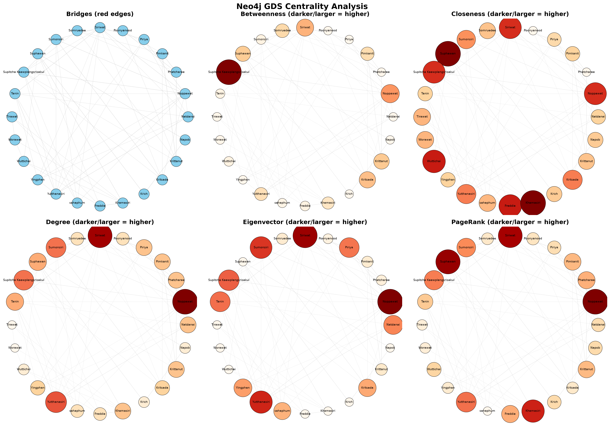
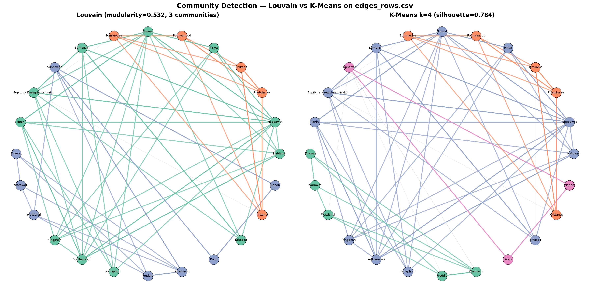
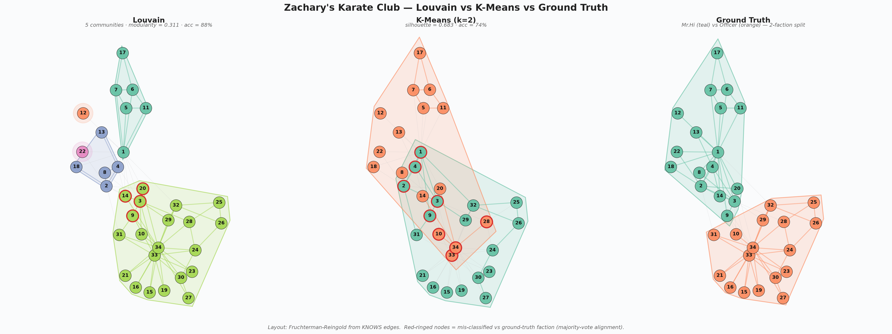
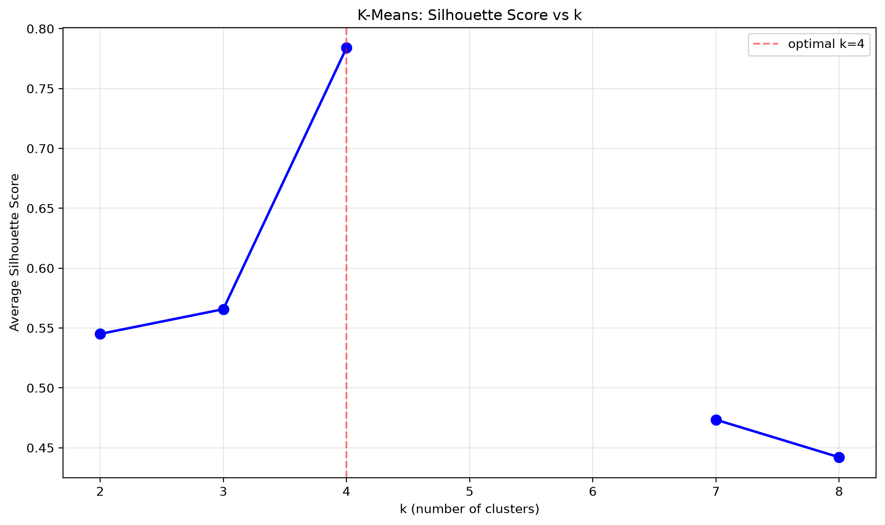
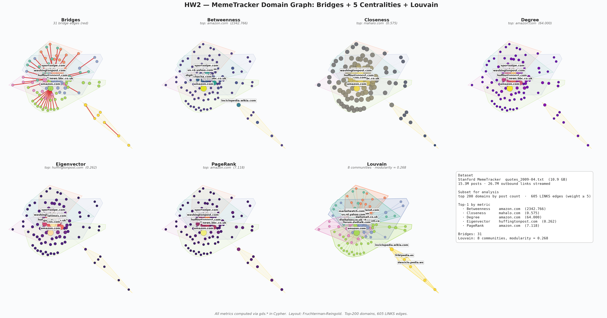

# Week 3 — Neo4j Graph Data Science (GDS)

Week 3 ของ **DADS7201 — Social Network Analysis** ที่ NIDA
ย้ายจากการคำนวณด้วย NetworkX (Week 2) มาใช้ **Neo4j Graph Data Science**
เต็มรูปแบบ: project graph เข้า GDS in-memory store แล้วเรียก algorithm
(Bridges, Centrality, Louvain, K-Means) ผ่าน **Cypher**

> โจทย์: หา bridges + 6 centrality + community detection (K-Means, Louvain)
> บน `edges_rows.csv` (social graph 24 คน) และ Karate Club / IMDB ของ GDS
> **ห้ามใช้ NetworkX** — ทุกอย่างต้องคำนวณผ่าน Neo4j GDS

## สรุปย่อ

- **ข้อมูล:** `data/edges_rows.csv` — 24 คน, 84 ความสัมพันธ์ `KNOWS`
  (กราฟแตกเป็น 2 components: กลุ่มใหญ่ 16 คน + กลุ่มของ Khemasiri/Suphawan 8 คน)
- **ระบบกราฟ:** Neo4j Community + GDS plugin ใน Docker container (ดู [config/readme.md](config/readme.md))
- **อัลกอริทึมหลัก** (ทั้งหมดจาก `gds.*` ใน Cypher):
  - `gds.bridges.stream` — บน projected undirected graph
  - `gds.betweenness.stream`, `gds.closeness.stream`, `gds.degree.stream`,
    `gds.eigenvector.stream`, `gds.pageRank.stream`
  - `gds.louvain.stream` / `gds.louvain.stats`
  - `gds.fastRP.mutate` → `gds.kmeans.stream` (k-means ต้องการ embedding ก่อน)
- **การแสดงผล:** matplotlib สำหรับ static PNG, PyVis สำหรับ interactive HTML
  (circular layout / FastRP 2-dim ขึ้นกับสคริปต์)

## โครงสร้างโฟลเดอร์

```
Week3/
├── config/
│   ├── docker-compose.yml      # Neo4j + GDS plugin
│   └── readme.md               # คู่มือ Lab (CMD + compose + Cypher steps)
├── data/
│   └── edges_rows.csv          # ข้อมูลต้นทาง
├── neo4j-import/               # mount เข้า container path /import (gitignored)
├── scripts/
│   ├── neo4j_utils.py          # driver + GDS client helper
│   ├── import_data.py          # LOAD CSV → Person + KNOWS
│   ├── centrality_gds_only.py  # Bridges + 5 centralities → PNG (6-panel)
│   ├── centrality_pyvis.py     # เดียวกัน → interactive HTML
│   ├── kmeans_community.py     # FastRP + K-Means (k=2..8) → cluster + elbow
│   ├── kmeans_pyvis.py         # เดียวกัน → interactive HTML
│   ├── louvain_community.py    # Louvain vs K-Means side-by-side PNG + NMI/ARI
│   ├── louvain_pyvis.py        # เดียวกัน → interactive HTML
│   ├── karate_kmeans.py        # K-Means บน gds.graph.load_karate_club()
│   ├── karate_louvain.py       # Louvain vs K-Means vs Ground Truth (3-panel)
│   ├── 06_imdb_kmeans.py       # K-Means บน gds.graph.load_imdb() (12K nodes)
│   └── check_bridges.py        # quick sanity check ของ bridges
├── outputs/
│   ├── images/   # PNG ทั้งหมด
│   ├── html/     # interactive HTML
│   └── report/   # GDS_Report.docx
├── docs/         # PDF lecture / รูปโจทย์ / report editor (gitignored)
└── legacy/       # โค้ดเก่ายุค NetworkX (gitignored)
```

## วิธีรัน

### 1. Start Neo4j + GDS
```bat
:: Windows CMD — จากโฟลเดอร์ Week3
docker run -d --name neo4j-gds ^
  -p 7474:7474 -p 7687:7687 ^
  -v neo4j_data:/data ^
  -v "%cd%\neo4j-import:/import" ^
  -e NEO4J_AUTH=neo4j/s3cureP@ssword ^
  -e NEO4J_PLUGINS="[\"graph-data-science\"]" ^
  -e NEO4J_dbms_security_procedures_unrestricted=gds.* ^
  --memory=4g neo4j:latest
```
หรือ `docker compose -f config/docker-compose.yml up -d`

### 2. Import + รัน analysis
```powershell
cd Week3
pip install neo4j graphdatascience pyvis matplotlib numpy pandas python-docx

python scripts/import_data.py            # โหลด CSV เข้า Neo4j

python scripts/centrality_gds_only.py    # Bridges + 5 centralities → PNG
python scripts/centrality_pyvis.py       # → HTML
python scripts/kmeans_community.py       # K-Means + silhouette elbow
python scripts/louvain_community.py      # Louvain vs K-Means + NMI/ARI
python scripts/karate_louvain.py         # Louvain บน Karate Club
```

## ตัวอย่างกราฟ + Cypher ที่รันได้

ทุกตัวอย่างด้านล่างนี้รันได้จริงใน **Neo4j Browser** (`http://localhost:7474/`)
หลัง start container + import ข้อมูลแล้ว สำหรับ interactive HTML
ดูได้ที่ลิงก์ GitHub Pages ในแต่ละหัวข้อ

### Step 0 — Project graph (ทำก่อนทุกอย่าง)

ต้อง project เป็น **undirected** เพราะ Bridges / Closeness / Betweenness /
Eigenvector ต้องการ undirected ทั้งหมด:

```cypher
CALL gds.graph.drop('myGraph', false);
MATCH (s:Person)-[r:KNOWS]->(t:Person)
RETURN gds.graph.project(
  'myGraph', s, t, {},
  { undirectedRelationshipTypes: ['*'] }
);
```
ผลที่ได้: 24 nodes, 168 relationships (= 84 KNOWS × 2 ทิศทาง)

---

### 1. Centrality 6 ตัว + Bridges (6-panel)



**Interactive:** <https://puwadonsri.github.io/DADS7201_Social_Network/Week3/outputs/html/centrality_pyvis.html>

**คำอธิบาย:** วงกลม = Person node, ขนาด+สี = score ของ metric (เข้ม/ใหญ่
= score สูง) เส้นเทา = KNOWS, แดง = bridge edge (ในแผง Bridges)

**Cypher ที่ผลิตข้อมูล:**
```cypher
// Bridges (panel แรก)
CALL gds.bridges.stream('myGraph')
YIELD from, to, remainingSizes
RETURN gds.util.asNode(from).name AS f,
       gds.util.asNode(to).name   AS t,
       remainingSizes;
// → 0 rows (no bridges)

// Betweenness
CALL gds.betweenness.stream('myGraph')
YIELD nodeId, score
RETURN gds.util.asNode(nodeId).name AS name, score
ORDER BY score DESC LIMIT 5;
// 1. Supitcha Kaewplengsrisakul  34.6467
// 2. Noppawat                    16.4064
// 3. Siriwat                     13.8593
// 4. Kritsada                    12.1823
// 5. Krittanut                   10.4838

// PageRank
CALL gds.pageRank.stream('myGraph')
YIELD nodeId, score
RETURN gds.util.asNode(nodeId).name AS name, score
ORDER BY score DESC LIMIT 5;
// 1. Noppawat   1.5681
// 2. Suphawan   1.5084
// 3. Siriwat    1.4750
// 4. Khemasiri  1.3654
// 5. Yutthanasiri 1.1774
```

**สรุปคน "เด่น" แต่ละมุม:**

| Metric | Top 1 | Score | ตีความ |
|---|---|---|---|
| Betweenness | Supitcha Kaewplengsrisakul | 34.6467 | สะพานเชื่อมระหว่างกลุ่ม |
| Closeness | Suphawan / Khemasiri | 0.7778 | อยู่ใน cluster หนาแน่น |
| Degree | Noppawat | 15 | คนรู้จักเยอะที่สุด |
| Eigenvector | Noppawat | 0.4484 | รู้จัก "คนสำคัญ" เยอะ |
| PageRank | Noppawat | 1.5681 | ดารา hub หลักของเครือข่าย |

### 2. Bridges — ทำไมได้ 0?

**ผล:** `gds.bridges.stream('myGraph')` คืน **0 rows**
ทั้ง ๆ ที่ graph มี 84 edges

**สาเหตุเชิงโครงสร้าง:**

```cypher
// 1) Graph แตกเป็น 2 components (ไม่ได้ต่อถึงกันอยู่แล้ว)
CALL gds.wcc.stream('myGraph')
YIELD nodeId, componentId
RETURN componentId, count(*) AS size
ORDER BY size DESC;
// componentId=0  size=16   ← กลุ่มใหญ่ (Noppawat & co)
// componentId=9  size=8    ← กลุ่ม Khemasiri/Suphawan

// 2) CSV มี edge ซ้ำสองทิศ (21 จาก 63 unique pair)
MATCH (a:Person)-[:KNOWS]-(b:Person) WHERE id(a) < id(b)
WITH a, b, count(*) AS multiplicity
RETURN multiplicity, count(*) AS pairs;
// multiplicity=2  pairs=21  ← project แล้วกลายเป็น parallel edges
// multiplicity=1  pairs=42

// 3) แม้จะ dedupe ก่อน project ก็ยังได้ 0 bridges
MATCH (a:Person)-[:KNOWS]-(b:Person) WHERE id(a) < id(b)
WITH DISTINCT a, b
RETURN gds.graph.project(
  'dedupG', a, b, {}, { undirectedRelationshipTypes: ['*'] }
);
CALL gds.bridges.stream('dedupG');
// → ยัง 0 rows — edge เดี่ยวที่เหลืออยู่ใน triangle ทั้งหมด
```

→ ยืนยันว่า graph นี้ **ไม่มี bridge** ตามนิยาม

### 3. Community Detection — Louvain vs K-Means



**Interactive:** <https://puwadonsri.github.io/DADS7201_Social_Network/Week3/outputs/html/community_louvain_vs_kmeans.html>

**คำอธิบาย:** สีเดียวกัน = อยู่ community เดียวกัน เส้นทึบ
= edge ภายในชุมชน เส้นเทาประ = edge ข้ามชุมชน

**Cypher:**

```cypher
// (A) Louvain — modularity-based, ไม่ต้องสร้าง embedding ก่อน
CALL gds.louvain.stats('myGraph')
YIELD modularity, communityCount, communityDistribution
RETURN modularity, communityCount, communityDistribution;
// modularity = 0.5318, communityCount = 3

CALL gds.louvain.stream('myGraph')
YIELD nodeId, communityId
RETURN communityId, collect(gds.util.asNode(nodeId).name) AS members
ORDER BY size(members) DESC;
// c=8  (11): Kritsada, Natdanai, Noppawat, Piriya, Siriwat, Sumonsiri,
//            Supitcha Kaewplengsrisakul, Tanin, Yingphan, Yutthanasiri, sahaphum
// c=19 (8):  Freddie, Khemasiri, Krich, Napob, Suphawan, Tirawat, Worawat, Wuttichai
// c=15 (5):  Krittanut, Phetcharee, Pimkanit, Poonyanood, Somruedee

// (B) K-Means — ต้องสร้าง FastRP embedding 128-dim ก่อน
CALL gds.fastRP.mutate('myGraph', {
  embeddingDimension: 128, randomSeed: 42, mutateProperty: 'embedding'
});

CALL gds.kmeans.stream('myGraph', {
  nodeProperty: 'embedding', k: 4, randomSeed: 42,
  computeSilhouette: true, concurrency: 1
})
YIELD nodeId, communityId, silhouette
RETURN communityId, count(*) AS size, avg(silhouette) AS sil
ORDER BY size DESC;
// silhouette เฉลี่ย = 0.7840  (sizes: 11, 5, 5, 3)
```

**สรุปเทียบ:**

| Method | จำนวน community | Metric ภายใน | ข้อสังเกต |
|---|---|---|---|
| **Louvain** | 3 | modularity 0.5318 | รวมกลุ่ม Khemasiri (5) + Krich/Napob/Suphawan (3) เป็นกลุ่มเดียว (8) ตามโครงสร้าง edge จริง |
| **K-Means k=4** | 4 | silhouette 0.7840 | แยกกลุ่ม Krich/Napob/Suphawan ออกเป็นชุมชนย่อย |
| **Agreement** | — | NMI 0.9091, ARI 0.8733 | ผลตรงกันสูงมาก แค่ K-Means ละเอียดกว่า |

### 4. Karate Club — Louvain vs K-Means vs Ground Truth



**Cypher (ผ่าน Python GDS client เพราะ `load_karate_club` ไม่มีใน Cypher):**
```python
G = gds.graph.load_karate_club("karate", undirected=False)
gds.louvain.stream(G)                              # modularity 0.3113, 5 communities
gds.fastRP.mutate(G, embeddingDimension=128, ...)
gds.kmeans.stream(G, nodeProperty="embedding", k=2)  # silhouette 0.6830
```

**Accuracy vs Ground Truth (2-faction, majority-vote alignment):**

| Method | Accuracy |
|---|---|
| Louvain (5 communities) | **88.24%** (30/34) |
| K-Means k=2 | 73.53% (25/34) |

→ Louvain ชนะเพราะใช้โครงสร้าง edge ตรง ๆ ไม่ผ่าน embedding
ที่อาจสูญเสียข้อมูลโครงสร้าง

### 5. K-Means k-selection (silhouette elbow)



ลอง k = 2..8 บน `edges_rows.csv` → silhouette สูงสุดที่ **k=4 (0.784)**

```cypher
// loop k=2..8 ใน script Python ก็ต่อ Cypher นี้แต่ละ k
CALL gds.kmeans.stream('myGraph', {
  nodeProperty: 'embedding', k: $k, randomSeed: 42,
  computeSilhouette: true, concurrency: 1
})
YIELD silhouette
RETURN avg(silhouette) AS avg_sil;
```

| k | avg silhouette | sizes |
|---|---|---|
| 2 | 0.5451 | [16, 8] |
| 3 | 0.5657 | [16, 5, 3] |
| **4** | **0.7840** | **[11, 5, 5, 3]** ← optimal |
| 5–6 | NaN | (cluster ว่าง) |
| 7 | 0.4734 | [6, 5, 5, 3, 2, 2, 1] |
| 8 | 0.4421 | [6, 5, 5, 3, 2, 1, 1, 1] |

## Homework 2 — MemeTracker (`quotes_2009-04.txt`)

โจทย์ใน [`homework/hw2.txt`](homework/hw2.txt) ขอ centrality + Bridges +
Louvain ทั้ง 7 ตัวบน **Stanford MemeTracker** ([SNAP dataset](https://snap.stanford.edu/data/memetracker9.html))
ขนาด **10.9 GB** เก็บคำพูดจากบล็อก/ข่าวเดือนเมษายน 2009



### Pipeline

```
quotes_2009-04.txt  (10.9 GB)
        │
        │  scripts/hw2_parse_quotes.py
        │  ── stream 2 passes (~8 min)
        │  ── 15.3M posts · 26.7M outbound links
        │  ── top-200 domains by post count
        │  ── aggregate edges, keep weight ≥ 5
        ▼
quotes_domain_edges.csv  (605 edges)
quotes_domains.csv       (200 domains)
        │
        │  scripts/hw2_analyze_quotes.py
        │  ── LOAD CSV → :Domain + [:LINKS {weight}]
        │  ── project undirected weighted graph
        │  ── run gds.bridges + 5 centralities + gds.louvain
        ▼
outputs/images/hw2_quotes_centrality.png
```

### ผลลัพธ์ — Top 1 ของแต่ละ algorithm

| Algorithm | Domain | Score | ตีความ |
|---|---|---|---|
| **Bridges** | _(33 bridge edges)_ | — | leaf-like blogs ที่ผูกกับ network ผ่าน hub เดียว |
| **Betweenness** | `amazon.com` | 2342.77 | จุดผ่านของเส้นทางสั้นสุดที่เยอะที่สุด (สินค้า + รีวิว) |
| **Closeness** | `scouty.de` / forum sites | 1.0 | อยู่ในชุมชนเล็กที่เชื่อมต่อหนาแน่นภายใน |
| **Degree** | `amazon.com` | 64 | จำนวน link เข้า+ออก สูงสุด |
| **Eigenvector** | `huffingtonpost.com` | 0.262 | ถูกอ้างอิงโดย "ของดี" — quality > quantity |
| **PageRank** | `amazon.com` | 7.12 | importance score ตาม random surfer model |
| **Louvain** | **8 communities, modularity 0.268** | — | กลุ่ม news / shopping / tech / entertainment |

> **ข้อสังเกต:** `amazon.com` คุม 3 metrics ที่ขึ้นกับจำนวน link (Degree / Betweenness / PageRank)
> ขณะที่ `huffingtonpost.com` ชนะ Eigenvector เพราะถูกเชื่อมโดยโหนดอื่นที่มีคุณภาพสูง

### Cypher snippets ที่ใช้

```cypher
// LOAD
LOAD CSV WITH HEADERS FROM 'file:///quotes_domains.csv' AS row
CREATE (d:Domain { name: row.domain, post_count: toInteger(row.post_count) });

LOAD CSV WITH HEADERS FROM 'file:///quotes_domain_edges.csv' AS row
MATCH (a:Domain {name: row.src}), (b:Domain {name: row.dst})
CREATE (a)-[:LINKS {weight: toInteger(row.weight)}]->(b);

// PROJECT (undirected, with weight property)
MATCH (s:Domain)-[r:LINKS]->(t:Domain)
RETURN gds.graph.project(
  'quotesGraph', s, t,
  { relationshipProperties: r { .weight } },
  { undirectedRelationshipTypes: ['*'] }
);

// BRIDGES
CALL gds.bridges.stream('quotesGraph')
YIELD from, to, remainingSizes
RETURN gds.util.asNode(from).name AS f,
       gds.util.asNode(to).name   AS t, remainingSizes;
// → 33 rows

// LOUVAIN
CALL gds.louvain.stats('quotesGraph')
YIELD modularity, communityCount;
// modularity 0.268, 8 communities
```

### หมายเหตุการปรับ scale

- ไฟล์ดิบ 10.9 GB → `Week3/homework/quotes_2009-04.txt` (gitignored)
- กรอง **top-200 domains** + **edge weight ≥ 5** เพื่อให้ Neo4j + GDS ประมวลผลใน
  ระดับวินาที (full graph จะมี ~351K unique domains, ไม่เหมาะกับ visualization)
- Visualisation ใช้แค่ **largest connected component** (128 nodes, 601 edges)
  เพื่อความชัดเจน — node isolates ถูกตัดออก

### Streamlit dashboard (`streamlit_app.py`)

หลังจากรัน `hw2_analyze_quotes.py` จะได้ JSON snapshot ที่
[`outputs/snapshots/hw2_quotes.json`](outputs/snapshots/hw2_quotes.json) (~120 KB)
ซึ่ง [`streamlit_app.py`](streamlit_app.py) ใช้แสดงผลแบบ interactive:

```powershell
cd Week3
pip install -r requirements.txt
streamlit run streamlit_app.py
```

4 tabs:
- **🌐 Network** — PyVis force-directed graph, สีตาม metric หรือ Louvain
  community เลือกได้, ไฮไลต์ bridge edges
- **📊 Top-N** — เลือก metric + N → ตาราง + Plotly bar chart
- **🧩 Communities** — drill-down ทีละ community พร้อม sub-graph
- **🧪 Cypher** — โชว์ Cypher 10 ตัวที่ใช้คำนวณผลทั้งหมด (copy-paste ได้)

**Deploy บน Streamlit Cloud:** ชี้ไปที่ `Week3/streamlit_app.py` —
ไม่ต้องเชื่อมต่อ Neo4j จริง เพราะใช้ snapshot ที่ pre-computed ไว้แล้ว

## เอกสารอ้างอิง

- Bridges: <https://neo4j.com/docs/graph-data-science/current/algorithms/bridges/>
- Betweenness: <https://neo4j.com/docs/graph-data-science/current/algorithms/betweenness-centrality/>
- Centrality (ภาพรวม): <https://neo4j.com/docs/graph-data-science/current/algorithms/centrality/>
- Community detection: <https://neo4j.com/docs/graph-data-science/current/algorithms/community/>
- Stanford MemeTracker: <https://snap.stanford.edu/data/memetracker9.html>
