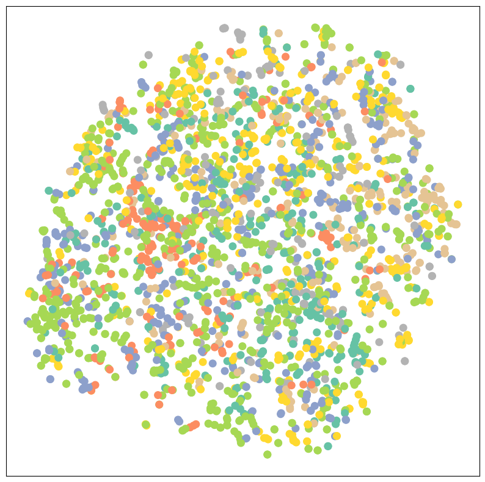
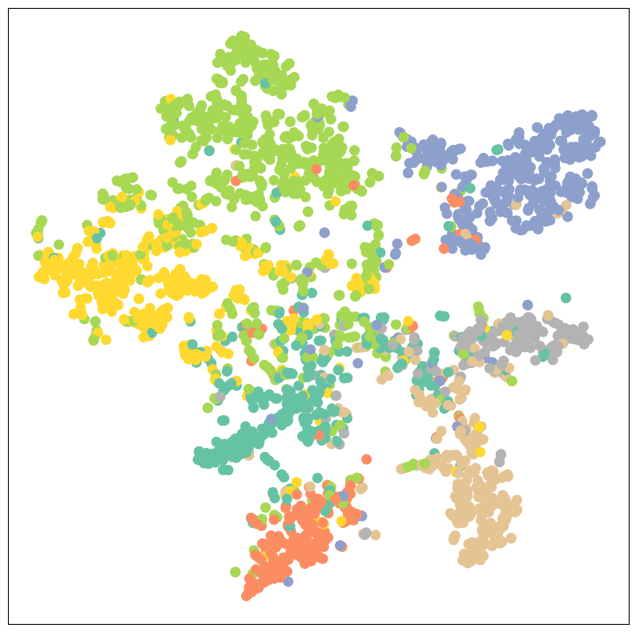
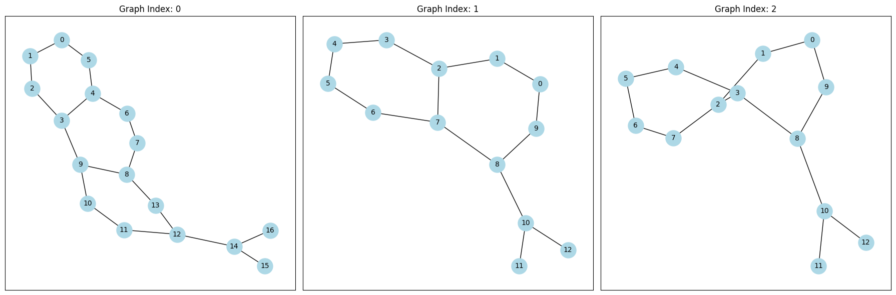

# Week 6 — Graph Neural Networks (Node & Graph Classification)

Week 6 ของ **DADS7201 — Social Network Analysis** ที่ NIDA — ต่อจาก
node embedding (Week 5) เข้าสู่ **Graph Neural Networks (GNN)** เต็มตัว
ผ่าน 2 task หลัก: **node classification** (Cora) และ **graph classification** (MUTAG)

> Slides + notebook ต้นทาง อยู่ใน [`Slide/`](Slide/) (gitignored)

## หัวใจของ GNN — Message Passing

```
        Layer ℓ                        Layer ℓ+1
   ┌──────────┐                    ┌──────────┐
   │  x_a^ℓ   │──┐                 │ x_a^ℓ+1  │
   └──────────┘  │  aggregate      └──────────┘
                 ├──► Σ (n∈N(v))
   ┌──────────┐  │       + self         ▲
   │  x_v^ℓ   │──┤       │ W · normalise │
   └──────────┘  │       ▼               │
                 ├──► x_v^ℓ+1 ──────────┘
   ┌──────────┐  │
   │  x_c^ℓ   │──┘
   └──────────┘
```

**GCN layer** ([Kipf & Welling 2017](https://arxiv.org/abs/1609.02907)):

$$
x_v^{(\ell+1)} = W^{(\ell+1)} \sum_{w \in \mathcal{N}(v) \cup \{v\}} \frac{1}{c_{w,v}} \cdot x_w^{(\ell)}, \qquad c_{w,v} = \sqrt{\deg(w)\deg(v)}
$$

เทียบกับ MLP layer ที่มองไม่เห็นเพื่อนบ้าน:

$$
x_v^{(\ell+1)} = W^{(\ell+1)} \cdot x_v^{(\ell)}
$$

**ต่างกัน:** GCN รวม feature ของ **เพื่อนบ้าน 1-hop** เข้ามาก่อนคูณ W → ซ้อน L layer = receptive field ครอบ **L-hop**

---

## 1. Node Classification — Cora ([`2_Node_Classification.ipynb`](Slide/2_Node_Classification.ipynb))

### Dataset: Cora citation network

| Property | Value |
|---|---|
| Nodes | 2,708 papers |
| Edges | 10,556 citation links |
| Features | 1,433-dim bag-of-words |
| Classes | 7 หัวข้อวิจัย |
| Train mask | **140 node** (20 ต่อ class) → label rate เพียง 5% |
| Transform | `NormalizeFeatures()` (row-normalise) |

> **Transductive setting:** เห็น graph ทั้งหมดตอน train แต่รู้ label แค่ 140 node → propagate ผ่าน edge

### เทียบ 3 โมเดล

| Model | ใช้ edge ไหม? | Test Accuracy | หมายเหตุ |
|---|:---:|:---:|---|
| **MLP** (2-layer, hidden=16) | ❌ | **57.4%** | overfit ทันที เพราะ label น้อย + ไม่เห็นเพื่อนบ้าน |
| **GCN** (2-layer, hidden=16) | ✅ | **81.1%** | +24pt โดยแค่เปลี่ยน `Linear` → `GCNConv` |
| **GAT** (2-layer, 8 heads) | ✅ + attention | ~82% | learn น้ำหนักเพื่อนบ้านต่างกัน |

### เห็นด้วยตา — t-SNE ของ GCN embedding (Cora, 7 classes)

| ก่อน train (init random) | หลัง train 100 epoch |
|:---:|:---:|
|  |  |
| สีปนกันหมด — ไม่มีสัญญาณ community | 7 cluster ชัด (1 cluster ต่อ 1 หัวข้อวิจัย) |

> โมเดลเดียวกัน 2-layer GCN — ต่างกันแค่ "ผ่าน backprop มา 100 epoch"
> **inductive bias ของ GCN** ทำงาน: node ที่ cite กัน → embedding ไปกองด้วยกัน

### GCN code (ที่ต่างจาก MLP แค่บรรทัดเดียว)

```python
from torch_geometric.nn import GCNConv

class GCN(torch.nn.Module):
    def __init__(self, hidden_channels):
        super().__init__()
        torch.manual_seed(1234567)
        self.conv1 = GCNConv(dataset.num_features, hidden_channels)  # 1433 → 16
        self.conv2 = GCNConv(hidden_channels, dataset.num_classes)   # 16 → 7

    def forward(self, x, edge_index):
        x = self.conv1(x, edge_index).relu()
        x = F.dropout(x, p=0.5, training=self.training)
        x = self.conv2(x, edge_index)
        return x

# Train loop เหมือน PyTorch ปกติ — Adam(lr=0.01, weight_decay=5e-4), CE loss
# loss = criterion(out[data.train_mask], data.y[data.train_mask])   # semi-supervised
```

### GAT — เพิ่ม attention ระหว่าง node

```python
from torch_geometric.nn import GATConv

class GAT(torch.nn.Module):
    def __init__(self, hidden_channels, heads):
        super().__init__()
        self.conv1 = GATConv(dataset.num_features, hidden_channels,
                             heads=heads, dropout=0.6)                    # 8 heads
        self.conv2 = GATConv(hidden_channels * heads, dataset.num_classes,
                             heads=1, concat=False, dropout=0.6)          # 1 head, average

    def forward(self, x, edge_index):
        x = F.dropout(x, p=0.6, training=self.training)
        x = F.elu(self.conv1(x, edge_index))
        x = F.dropout(x, p=0.6, training=self.training)
        return self.conv2(x, edge_index)
```

> **Attention score** ระหว่าง node `i, j`:
> $\alpha_{ij} = \text{softmax}_j\bigl(\text{LeakyReLU}(a^\top [W x_i \, \| \, W x_j])\bigr)$
> — เรียน "weight ของ edge" แทนที่จะใช้ `1/√(d_i·d_j)` แบบ GCN

---

## 2. Graph Classification — MUTAG ([`3_Graph_Classification.ipynb`](Slide/3_Graph_Classification.ipynb))

จำแนก **ทั้งกราฟ** ว่าเป็น class ไหน (ไม่ใช่จำแนก node)
Task ที่พบบ่อย: **molecular property prediction** — โมเลกุลนี้ยับยั้ง HIV ได้หรือไม่?

### Dataset: MUTAG (TUDataset)

| Property | Value |
|---|---|
| Graphs | 188 โมเลกุล |
| Classes | 2 (mutagenic vs non-mutagenic) |
| Features | 7-dim (atom type one-hot) |
| Split | 150 train / 38 test (shuffle seed=12345) |

```python
from torch_geometric.datasets import TUDataset

dataset = TUDataset(root='data/TUDataset', name='MUTAG')
# Data(edge_index=[2, 38], x=[17, 7], edge_attr=[38, 4], y=[1])
#   ↑ กราฟแรก: 17 อะตอม, 38 พันธะ, label 1 ตัว
```

### ตัวอย่างกราฟ 3 อันแรกใน MUTAG



> แต่ละกราฟคือ 1 โมเลกุล — node = อะตอม, edge = พันธะเคมี
> label = "โมเลกุลนี้ mutagenic ต่อ *S. typhimurium* หรือไม่"
> โจทย์คือดูจากโครงสร้าง (topology + atom type) → ทำนาย label ของกราฟ

### Recipe ของ graph classification

```
┌────────────────┐   ┌────────────────┐   ┌────────────────┐   ┌──────────┐
│  node feature  │──►│  L × GNN layer │──►│  readout pool  │──►│  Linear  │──► ŷ
│  x ∈ [N, F]    │   │  message pass  │   │  aggregate all │   │  head    │
└────────────────┘   └────────────────┘   └────────────────┘   └──────────┘
                                            (mean / max / sum)
```

**Readout layer** — บีบ node embedding ทั้งกราฟให้เป็น **graph embedding** ตัวเดียว:

$$
x_G = \frac{1}{|V|} \sum_{v \in V} x_v^{(L)}
$$

PyG: `global_mean_pool(x, batch)` → shape `[batch_size, hidden]`

### Mini-batching แบบ PyG — "gian graph" trick

CNN/RNN ทำ mini-batch ด้วยการ *pad* ให้ shape เท่ากัน แต่กราฟ pad ไม่ได้
PyG แก้โดย **stack adjacency แบบเฉียง** ทำเป็นกราฟยักษ์กราฟเดียว:

```
     Graph 1        Graph 2       Graph 3           Batched (block-diagonal)
   ┌────────┐    ┌────────┐    ┌────────┐          ┌──────┬──────┬──────┐
   │  A_1   │    │  A_2   │    │  A_3   │    ──►   │ A_1  │  0   │  0   │
   └────────┘    └────────┘    └────────┘          ├──────┼──────┼──────┤
                                                    │  0   │ A_2  │  0   │
   x_1, x_2, x_3 concat ตาม node dimension          ├──────┼──────┼──────┤
                                                    │  0   │  0   │ A_3  │
   batch = [0,0,...,0, 1,1,...,1, 2,2,...,2]        └──────┴──────┴──────┘
   (บอกว่า node ไหนอยู่กราฟไหน)
```

**ข้อดี:** GPU ใช้ได้เต็ม, ไม่ต้อง pad, node ต่างกราฟไม่ leak (block-diagonal = ไม่มี edge เชื่อม)

```python
from torch_geometric.loader import DataLoader

train_loader = DataLoader(train_dataset, batch_size=64, shuffle=True)
# 150 / 64 = 3 batches (64 + 64 + 22)

for batch in train_loader:
    # batch.x         [ΣN_i, 7]      concat feature
    # batch.edge_index [2, ΣE_i]     concat edge index (offset แล้ว)
    # batch.batch     [ΣN_i]         assignment vector [0..63]
    # batch.y         [64]           1 label ต่อกราฟ
```

### GCN + readout เต็มโมเดล

```python
from torch_geometric.nn import GCNConv, global_mean_pool
from torch.nn import Linear

class GCN(torch.nn.Module):
    def __init__(self, hidden_channels):
        super().__init__()
        torch.manual_seed(12345)
        self.conv1 = GCNConv(dataset.num_node_features, hidden_channels)
        self.conv2 = GCNConv(hidden_channels, hidden_channels)
        self.conv3 = GCNConv(hidden_channels, hidden_channels)
        self.lin   = Linear(hidden_channels, dataset.num_classes)

    def forward(self, x, edge_index, batch):
        # 1. node embedding via message passing (3-hop receptive field)
        x = self.conv1(x, edge_index).relu()
        x = self.conv2(x, edge_index).relu()
        x = self.conv3(x, edge_index)

        # 2. readout — บีบ node → graph embedding
        x = global_mean_pool(x, batch)          # [batch_size, hidden]

        # 3. classify
        x = F.dropout(x, p=0.5, training=self.training)
        return self.lin(x)

model = GCN(hidden_channels=64)
# 170 epoch, Adam(lr=0.01), CE loss → Test Acc ≈ 76%
```

> **ทำไม 76% เท่านั้น?** dataset เล็กมาก (38 test graph) → variance สูง
> ผลจะนิ่งขึ้นบน dataset ใหญ่อย่าง PROTEINS, ENZYMES, OGB-molhiv

### `GraphConv` — variant ที่แยก self จาก neighbours

Exercise ในโน้ตบุ๊คให้ลอง swap `GCNConv` → `GraphConv`:

$$
x_v^{(\ell+1)} = W_1 x_v^{(\ell)} + W_2 \sum_{w \in \mathcal{N}(v)} x_w^{(\ell)}
$$

- **GCN:** normalise แล้วรวม self + neighbours ในสูตรเดียว
- **GraphConv:** แยก transform self (`W_1`) กับ neighbours (`W_2`) → expressive กว่าเล็กน้อย

---

## GNN Layer zoo — เลือกใช้ยังไง?

| Layer | Aggregate | ต้องใช้ node feature? | จุดเด่น |
|---|---|:---:|---|
| **GCN** (`GCNConv`) | mean-like (symmetric normalise) | ✅ | เริ่มต้น, ง่าย, จับ homophily ดี |
| **GAT** (`GATConv`) | attention-weighted | ✅ | เรียน weight ของแต่ละ edge เอง |
| **GraphSAGE** (`SAGEConv`) | mean/max/LSTM + concat self | ✅ | inductive (generalise ไป node ใหม่ได้) |
| **GIN** (`GINConv`) | sum + MLP | ✅ | expressive ที่สุดในกลุ่มนี้ (WL test) |
| **GraphConv** | separate W สำหรับ self/neighbours | ✅ | drop-in replacement ของ GCN |

**ตัวเลือกตาม task:**
- Node classification, homophily graph → **GCN / GAT**
- Node classification, heterophily → **GraphSAGE**
- Graph classification (โมเลกุล) → **GIN + sum readout**
- Scale ใหญ่มาก (millions of nodes) → **GraphSAGE + neighbour sampling**

---

## Node vs Graph classification — เทียบท่า

| | Node classification | Graph classification |
|---|---|---|
| **Input** | 1 กราฟใหญ่ | หลายกราฟเล็ก |
| **Label** | ต่อ node (partial mask) | ต่อกราฟ |
| **Setting** | Transductive (semi-supervised) | Inductive (train/test แยกกราฟ) |
| **Readout** | ไม่มี — ใช้ node embedding ตรง | **จำเป็น** — pool node → graph |
| **Loss mask** | `out[train_mask]` | ทั้ง batch |
| **ตัวอย่าง** | Cora, Citeseer, ogbn-arxiv | MUTAG, PROTEINS, ogbg-molhiv |

---

## ความรู้พื้นฐานที่ควรมี

- **Week 5** — node embeddings, การเดินสุ่ม, GCN preview บน Karate Club
- PyTorch: `nn.Module`, `optimizer.step()`, cross-entropy loss
- PyTorch Geometric basics: `Data` object, `edge_index` (COO format), `Batch`
- Softmax, dropout, ReLU / ELU
