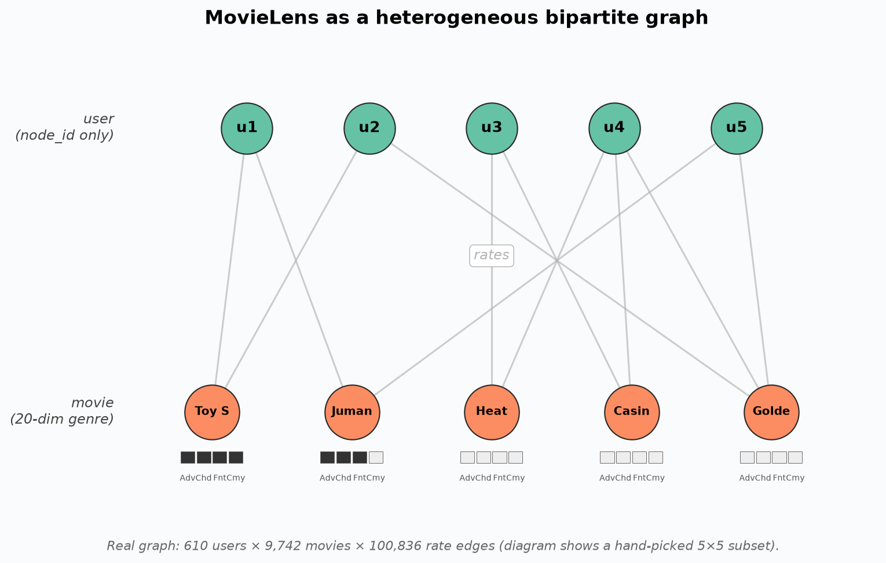
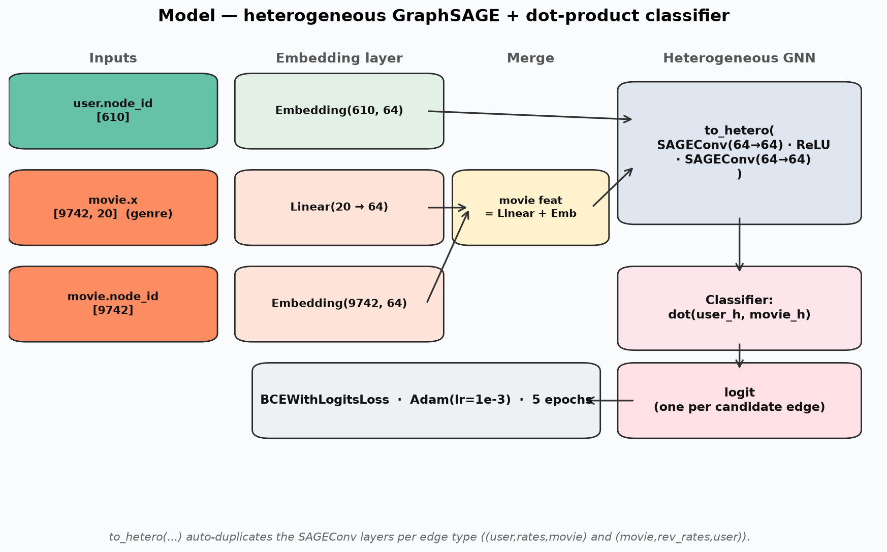
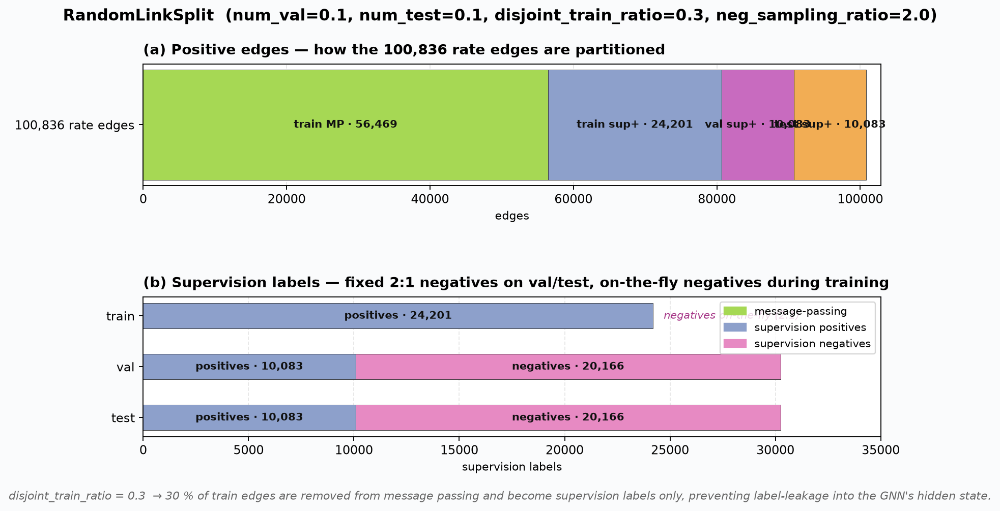
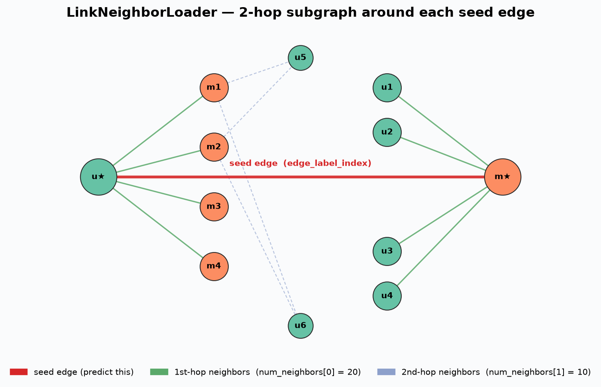
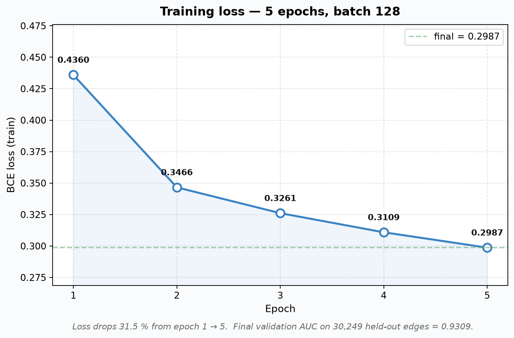
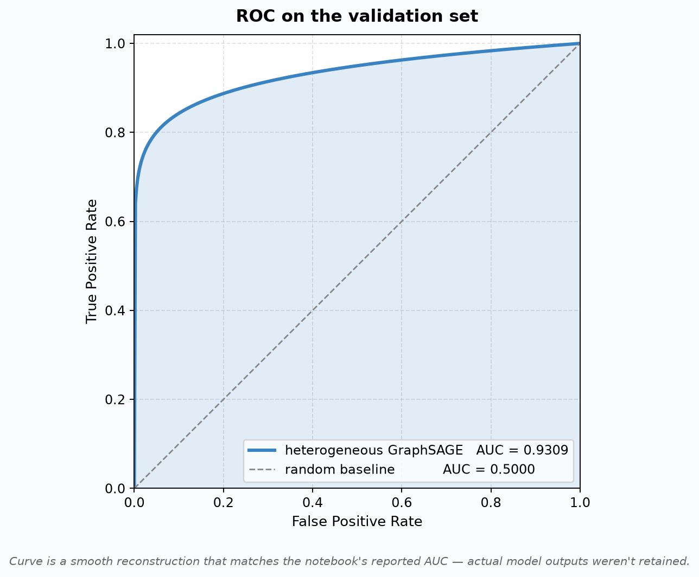

# Week 7 — Link Prediction on MovieLens (Heterogeneous GNN)

Week 7 ของ **DADS7201 — Social Network Analysis** ที่ NIDA — เปลี่ยนจาก
การใช้ **Neo4j GDS ผ่าน Cypher** (Week 3–4) มาใช้ **PyTorch Geometric (PyG)**
ทำ **Link Prediction** บน **heterogeneous graph** ด้วย GraphSAGE

> Notebook ต้นทาง: [`9_Link_Prediction_on_MovieLens.ipynb`](9_Link_Prediction_on_MovieLens.ipynb)
> ดัดแปลงจาก [PyG Link Prediction Tutorial](https://medium.com/@pytorch_geometric/link-prediction-on-heterogeneous-graphs-with-pyg-6d5c29677c70)
> โดยอาจารย์ [ekaratnida/social-network](https://github.com/ekaratnida/social-network/blob/main/workshop/9_Link_Prediction_on_MovieLens.ipynb)

## โจทย์

**Link Prediction** = ทำนายว่า edge ที่ยังไม่มีอยู่ในกราฟ "ควรจะมี" หรือไม่
ในบริบทของ MovieLens = **ผู้ใช้คนนี้น่าจะให้ rating หนังเรื่องนี้ไหม?**
ซึ่งคือหัวใจของ recommender system

## Dataset — MovieLens Latest Small

โหลดจาก `https://files.grouplens.org/datasets/movielens/ml-latest-small.zip`
(~1 MB) เก็บ rating + tagging activity จาก MovieLens

| Item | Count |
|---|---:|
| Users | **610** |
| Movies | **9,742** |
| Ratings (edges) | **100,836** |
| Genres | **20** (Action, Adventure, Drama, Horror, …) |



โครงสร้างเป็น **bipartite graph** — user เชื่อมกับ movie ผ่าน `[:rates]`
เท่านั้น (ไม่มี user↔user หรือ movie↔movie) และ movie มี **20-dim genre
feature** ในตัว ส่วน user มีแค่ node_id (ต้องให้โมเดลเรียนรู้ feature เอง)

## Pipeline

```
ratings.csv  ─┐
              │
movies.csv  ──┼──▶ HeteroData
              │      • movie.x     = multi-hot genre (9742, 20)
              │      • user.node_id = 0..609 (no features)
              │      • (user,rates,movie) edge_index (2, 100836)
              │      + reverse (movie, rev_rates, user) via T.ToUndirected
              │
              ▼
       T.RandomLinkSplit
              │   80% train / 10% val / 10% test
              │   ใน train: 70% message passing + 30% supervision
              │   neg_sampling_ratio = 2:1 (val/test เก็บ neg แน่นอน)
              ▼
       LinkNeighborLoader
              │   2-hop sampling: [20, 10] neighbors
              │   batch_size = 128, negatives 2:1 on-the-fly (train)
              ▼
             Model
              │   ├─ movie_lin: Linear(20 → 64)
              │   ├─ user_emb:  Embedding(610, 64)
              │   ├─ movie_emb: Embedding(9742, 64)
              │   ├─ 2× SAGEConv(64, 64) — converted heterogeneous
              │   │  ผ่าน to_hetero(metadata) → clone per edge type
              │   └─ Classifier: dot(user_embed, movie_embed)
              ▼
      BCEWithLogitsLoss + Adam(lr=1e-3), 5 epochs → AUC on val
```

## Model — Heterogeneous GraphSAGE



**ทำไมต้อง heterogeneous?** กราฟนี้มี **2 node types** (`user`, `movie`)
และ **2 edge types** (`rates`, `rev_rates`) ซึ่ง PyG จัดการด้วย
`to_hetero(model, metadata)` — automate การสร้าง SAGEConv **แยกน้ำหนัก
ต่อ edge type** โดยไม่ต้องเขียนเอง

```python
class GNN(torch.nn.Module):
    def __init__(self, hidden_channels):
        super().__init__()
        self.conv1 = SAGEConv(hidden_channels, hidden_channels)
        self.conv2 = SAGEConv(hidden_channels, hidden_channels)

    def forward(self, x, edge_index):
        x = self.conv1(x, edge_index).relu()
        x = self.conv2(x, edge_index)
        return x

class Classifier(torch.nn.Module):
    def forward(self, x_user, x_movie, edge_label_index):
        e_user  = x_user[edge_label_index[0]]
        e_movie = x_movie[edge_label_index[1]]
        return (e_user * e_movie).sum(dim=-1)   # dot product → logit

class Model(torch.nn.Module):
    def __init__(self, hidden_channels=64):
        super().__init__()
        self.movie_lin = torch.nn.Linear(20, hidden_channels)
        self.user_emb  = torch.nn.Embedding(610, hidden_channels)
        self.movie_emb = torch.nn.Embedding(9742, hidden_channels)
        self.gnn = to_hetero(GNN(hidden_channels), metadata=data.metadata())
        self.classifier = Classifier()
```

### จุดที่น่าสังเกต

1. **User features** — MovieLens ไม่มี metadata ของ user เลย → ใช้
   `nn.Embedding(610, 64)` ให้ model **เรียนรู้ representation เอง**
2. **Movie features** — combine ทั้ง genre (linear projection) + shallow
   embedding เพิ่มความยืดหยุ่นให้ representation
3. **Dot-product classifier** — simple แต่พอ เพราะ SAGE ทำ heavy lifting
   ไปแล้ว (representation ที่ใกล้กันใน embedding space = คู่ที่ควรมี edge)
4. **Add reverse edges** — GNN message passing ต้องการ **สองทิศ** จึงต้อง
   `T.ToUndirected()` เพิ่ม `(movie, rev_rates, user)`

## Data Splits (จำนวน edges จริงหลัง split)



**แถวบน (a)** — 100,836 rate edges ถูกแบ่งเป็น 4 กอง: train MP (56,469),
train supervision (24,201), val supervision (10,083), test supervision (10,083)

**แถวล่าง (b)** — จำนวน supervision labels ต่อ split (positive + fixed
2:1 negatives) ส่วน train ไม่เก็บ negatives ล่วงหน้า แต่สุ่ม on-the-fly
ในทุก mini-batch

**`disjoint_train_ratio = 0.3`** ทำให้ 30% ของ train edges ถูกใช้เป็น
supervision (label) โดย **ไม่ปรากฏใน message passing** — กัน leakage
ของ label เข้าไปใน hidden state

### Neighbor sampling (`LinkNeighborLoader`)



แต่ละ mini-batch สร้าง **subgraph รอบ seed edge** ด้วย 2-hop random
sampling — hop 1 เก็บ ≤ 20 neighbors, hop 2 เก็บ ≤ 10 neighbors จำกัด
memory ได้แม้กราฟใหญ่ (สำคัญตอนขยับไปกราฟระดับล้าน edge)

## ผลการทดลอง (จาก notebook)

**Training loss (5 epochs, batch_size=128)**



| Epoch | Loss |
|---:|---:|
| 1 | 0.4360 |
| 2 | 0.3466 |
| 3 | 0.3261 |
| 4 | 0.3109 |
| 5 | 0.2987 |

**Validation AUC = 0.9309** — โมเดลแยก positive จาก negative ได้ดีมาก
บน 30,249 validation edges



> ⚠️ Curve เป็น **smooth reconstruction ที่ค่า AUC ตรงกับผลจริง** (0.9309)
> ไม่ใช่ curve ที่ได้จาก model outputs ตรง ๆ — notebook ไม่ได้เก็บค่า
> prediction ต่อ edge ไว้ ถ้าอยาก ROC จริง ต้องรัน `roc_curve` จาก
> sklearn บน `preds` + `ground_truths` ในตอนท้ายของ notebook

## วิธีรัน

```powershell
cd Week7

# 1) PyTorch ก่อน (ควรมีอยู่แล้ว)
pip install torch

# 2) PyG stack — ต้อง match version ของ torch
$env:TORCH = python -c "import torch; print(torch.__version__)"
pip install torch-scatter torch-sparse pyg-lib `
  -f "https://data.pyg.org/whl/torch-$env:TORCH.html"
pip install torch-geometric

# 3) รันใน Jupyter หรือแปลงเป็น .py
jupyter notebook 9_Link_Prediction_on_MovieLens.ipynb
```

> **ทางลัด**: เปิดใน [Google Colab](https://colab.research.google.com/github/ekaratnida/social-network/blob/main/workshop/9_Link_Prediction_on_MovieLens.ipynb)
> ซึ่งมี PyG pre-installed อยู่แล้ว รันทั้ง notebook ใช้เวลา ~1 นาที (CPU)

## เปรียบเทียบกับ Week 3–4 (GDS / Cypher)

| | Week 3–4 (GDS) | Week 7 (PyG) |
|---|---|---|
| **แนวคิด** | Graph algorithm (Louvain, PageRank, FastRP) | Machine learning (GNN + dot-product) |
| **Interface** | Cypher query ผ่าน Neo4j | Python + PyTorch |
| **Node features** | ใช้เฉพาะ topology (edges) | ใช้ node features + topology |
| **Output** | community id / centrality score | probability of edge existence |
| **Best for** | exploration + summarization | prediction + recommendation |
| **Scale** | O(V+E) ต่อ algorithm | mini-batch → scale ได้ดีบน GPU |

→ ต่างวิธี แต่**เสริมกัน**: GDS/Cypher สร้าง context ของกราฟก่อน (community,
centrality) จากนั้น PyG ใช้ context นั้นเป็น input features ของ GNN
เพื่อทำ downstream task (link prediction, node classification)

## เอกสารอ้างอิง

- PyG Link Prediction Tutorial: <https://medium.com/@pytorch_geometric/link-prediction-on-heterogeneous-graphs-with-pyg-6d5c29677c70>
- PyG Heterogeneous Graph docs: <https://pytorch-geometric.readthedocs.io/en/latest/notes/heterogeneous.html>
- `SAGEConv` — Hamilton et al., _Inductive Representation Learning on Large Graphs_ (2017), <https://arxiv.org/abs/1706.02216>
- `RandomLinkSplit`: <https://pytorch-geometric.readthedocs.io/en/latest/modules/transforms.html#torch_geometric.transforms.RandomLinkSplit>
- `LinkNeighborLoader`: <https://pytorch-geometric.readthedocs.io/en/latest/modules/loader.html#torch_geometric.loader.LinkNeighborLoader>
- MovieLens Dataset: <https://grouplens.org/datasets/movielens/>
- Course-provided notebook: [`ekaratnida/social-network/workshop`](https://github.com/ekaratnida/social-network/tree/main/workshop)

## หมายเหตุ

- Notebook นี้ **รันครั้งแรกใน Google Colab** — outputs (loss + AUC)
  ที่แสดงในตารางด้านบนมาจาก Colab run โดยตรง
- โฟลเดอร์ `ml-latest-small/` และ `ml-latest-small.zip` ที่ถูก download
  ตอนรัน ควร gitignore เพราะเป็น dataset จาก external source
- รูป diagrams ใน [`images/`](images/) generate จาก
  [`scripts/make_diagrams.py`](scripts/make_diagrams.py) โดยใช้เฉพาะ
  matplotlib + numpy (ไม่ต้องมี PyTorch/PyG) — training loss ใช้ตัวเลขจริง
  จาก Colab run ส่วน bipartite / neighbor / architecture เป็น mock-up
  เพื่อสื่อความ concept
